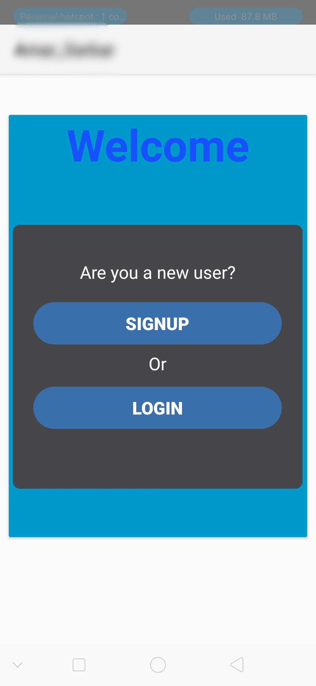

# Server Connection Android

Book Dash is an Android App which connect with a server fetch data and stores user information in the database.

# Freatures

1.User signup/login

2.Fetch current location of user using GOcoader & Location Manager.

3.Edit user profile fetch or uplord data using [JSON request,String request] Volley Libreary.

4.uplord and fetch images using Picasso Librery.

5.Castomized navication bar and feedback section.

6.Share app  in whatsaap,fb,massage,e_mail etc.

7.Multi language feature

# Screenshots
 

 	

 			

 			
 			
<h3>Starting</h3>		

 			

 		

 	

 			

 			
 			
<h3>Login</h3>		

 			

 		

 	

 			

 			
 			
<h3>Signup</h3>		

 			

 		

 	

 			

 			
 			
<h3>Loarding</h3>		

 			

 		

 	

 			

 			
 			
<h3>Home</h3>		

 			

 		

 	

 			

 			
 			
<h3>Navbar</h3>		

 			

 		

 	

 			

 			
 			
<h3>Profile</h3>		

 			

 		

 	

 			

 			
 			
<h3>Seting</h3>		

 			

 		

 	

 			

 			
 			
<h3>Language Option</h3>		

 			

 		

# What does this app do?
It is besecaly Stores user data for creating account , Suggest user some scheme with descriptions and allow user to appy for a scheme and track the status.It suggest user scheme according to their current location.

# Libraries this app uses:

 implementation fileTree(include: ['*.jar'], dir: 'libs')
    implementation 'androidx.appcompat:appcompat:1.1.0'
    implementation 'com.google.android.material:material:1.0.0'
    implementation 'androidx.constraintlayout:constraintlayout:1.1.3'
    implementation 'com.google.android.gms:play-services-maps:17.0.0'
    implementation 'androidx.appcompat:appcompat:1.1.0'
    implementation 'androidx.constraintlayout:constraintlayout:1.1.3'
    // implementation 'androidx.appcompat:appcompat:1.0.2'
    // implementation 'androidx.appcompat:appcompat:1.0.2'
    implementation 'androidx.legacy:legacy-support-v4:1.0.0'
    testImplementation 'junit:junit:4.12'
    androidTestImplementation 'androidx.test:runner:1.2.0'
    androidTestImplementation 'androidx.test.espresso:espresso-core:3.2.0', {
        exclude group: 'com.android.support', module: 'support-annotations'

    }
    // implementation  'com.squareup.okhttp3:okhttp:3.0.1'
    implementation 'com.squareup.okhttp:okhttp:2.0.0'
    implementation 'com.squareup.okhttp:okhttp-urlconnection:2.0.0'
    implementation 'com.android.volley:volley:1.1.1'
    implementation files('libs/mysql-connector.jar')
    implementation 'com.google.android.gms:play-services-location:17.0.0'
    implementation 'com.google.android.material:material:1.0.0'
    // implementation 'com.google.android.material:material:1.0.0-beta01'
    implementation 'com.squareup.picasso:picasso:2.5.2'
# Setup

1. Clone or download this repo.

2.Open in Android studio

3.Downlord the requird Libbreary

4.Chenge the URL as per your Database

# [OPTIONAL setup] 
1. If you wish to build a release version you will need to create your own keystore file and edit the password values in the following file - (create a version of the file without the .sample extension): release-keystore.properties.sample
2. Setup a Fabric Account. https://fabric.io/dashboard
3. Get your Fabric API Key and Client key, change it in the file: /app/fabric-sample.properties and rename the file to fabric.properties

 

# License

     GNU GENERAL PUBLIC LICENSE
                       Version 3, 29 June 2007

 Copyright (C) 2007 Free Software Foundation, Inc. <https://fsf.org/>
 Everyone is permitted to copy and distribute verbatim copies
 of this license document, but changing it is not allowed.
 
 To see the LIsence go to  <https://github.com/hiron1999/Server-connection/blob/master/LICENSE>
 
